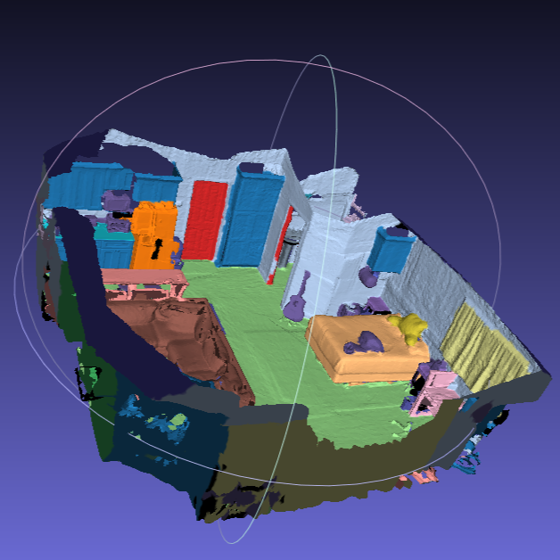
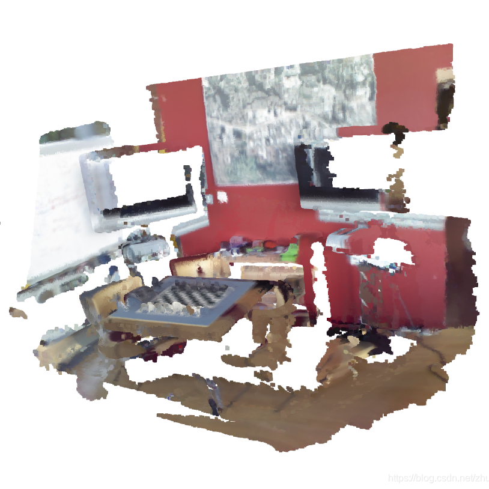
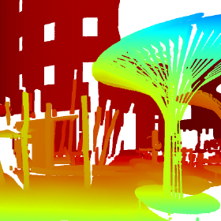

<!DOCTYPE html>
<html lang="zh">
  <head>
    <meta charset="UTF-8" />
    <meta name="viewport" content="width=device-width, initial-scale=1.0" />
    <meta http-equiv="X-UA-Compatible" content="ie=edge" />
    <title>点云配准体验平台</title>
    <link rel="stylesheet" href="fontawesome-5.5/css/all.min.css" />
    <link rel="stylesheet" href="slick/slick.css">
    <link rel="stylesheet" href="slick/slick-theme.css">
    <link rel="stylesheet" href="magnific-popup/magnific-popup.css">
    <link rel="stylesheet" href="css/bootstrap.min.css" />
    <link rel="stylesheet" href="css/tooplate-infinite-loop.css" />
<!--
Tooplate 2117 Infinite Loop
https://www.tooplate.com/view/2117-infinite-loop
-->

  </head>
  <body>    
    <!-- Hero section -->
    <section id="infinite" class="text-white tm-font-big tm-parallax">
      <!-- Navigation -->
      <nav class="navbar navbar-expand-md tm-navbar" id="tmNav">              
        
   
          

              <a href="#infinite" class="navbar-brand">点云配准</a>
          
             
            
          <button class="navbar-toggler" type="button" data-toggle="collapse" data-target="#navbarSupportedContent" aria-controls="navbarSupportedContent" aria-expanded="false" aria-label="Toggle navigation">
            <i class="fas fa-bars navbar-toggler-icon"></i>
          </button>
          

            <ul class="navbar-nav ml-auto">
              <li class="nav-item">
                  <a class="nav-link tm-nav-link" href="#infinite">主页</a>
              </li>
              <li class="nav-item">
                  <a class="nav-link tm-nav-link" href="#whatwedo">算法介绍</a>
              </li>
              <li class="nav-item">
                <a class="nav-link tm-nav-link" href="#testimonials">数据集</a>
              </li>
              <li class="nav-item">
                  <a class="nav-link tm-nav-link" href="#gallery">效果展示</a>
              </li>
              <li class="nav-item">
                  <a class="nav-link tm-nav-link" href="#contact">性能指标</a>
              </li>                    
            </ul>
          
        
        

      </nav>
      
      

        

            <h2 class="tm-hero-title">点云配准展示&体验平台</h2>
            

              欢迎体验点云配准算法的奇妙世界！
               中国大学生计算机设计大赛-算法设计与应用项目
            

        
        
      

      

        <a href="#whatwedo" class="text-center tm-down-arrow-link">
          <i class="fas fa-2x fa-arrow-down tm-down-arrow"></i>
        </a>
      
      
    </section>

    <section id="whatwedo" class="tm-section-pad-top">
      
      

            
<!-- first row -->
                

                    

                        <h2 class="tm-text-primary mb-4 tm-section-title">算法介绍</h2>
                        

                          在这一部分，我将为您介绍什么是点云配准算法。点云配准算法是一类用于将两个或多个点云数据集对齐或注册的算法，它是计算机视觉、机器人学和计算机图形学中的重要问题，其应用包括三维重建、环境建模、目标识别与跟踪等。在我们的算法设计与应用当中，我们主要设计并实现了以下创新之处：
                    

                

            
<!-- first row -->
            
            
<!-- second row -->
        		

                    <i class="far fa-3x fa-chart-bar text-center tm-icon"></i>
                

                

                    

                        <h2 class="tm-text-primary mb-4">快速变换估计</h2>
                        

                          基于YOHO算法提取点云数据局部特征，聚合局部描述子，进而使用NetVlad网络算法构建点云数据的全局特征。基于点云的全局特征估算站与站之间的点云重叠率效率较高，能够实现快速变换估计。

                    

                

                
                

                    <i class="far fa-3x fa-comment-alt text-center tm-icon"></i>
                

                

                    

                        <h2 class="tm-text-primary mb-4">稀疏图构建</h2>
                        

                          传统的位姿图构建基于密集图，即两两点云之间均进行配准构造位姿图。本算法设计创新性使用稀疏图构建方案，仅在基于前top-k的重叠度筛选出的配准候选集中进行两两配准，实现高效高利用率。
                        

                    

                

            
<!-- second row -->
            
            
<!-- third row -->
        		

                    <i class="fas fa-3x fa-fingerprint text-center tm-icon"></i>
                

                

                    

                        <h2 class="tm-text-primary mb-4">多站位姿解算</h2>
                        

                      基于IRLS（迭代加权最小二乘优化算法）的选权迭代运算，反复更新权重，以逐步逼近最小化加权最小二乘损失函数的目标，从而实现多站点云位姿解算，即所有点云同时在同一全局特征下实现配准，突破了传统的两站点云配准低效耗时的桎梏。

                          
                          

                            <a href="#testimonials" class="tm-intro-text tm-btn-primary">查看数据集</a>
                        

                    

                

                
                

                    <i class="fas fa-3x fa-users text-center tm-icon"></i>
                

                

                    

                      <h2 class="tm-text-primary mb-4">历史重加权函数</h2>
                        

                      由于IRLS早期迭代过程中会出现离群值偏向和无法修剪的问题，设计历史重加权函数，即特定迭代的权重考虑所有先前历史迭代的残差以确定当前迭代的稳健权重，这样就可以实现对离群值的不敏感处理，从而避免局部最优与离群值偏向。 

                          
                          

                            <a href="#gallery" class="tm-intro-text tm-btn-primary">查看配准效果</a>
                        

                    

                

            
<!-- third row -->

        

      
    </section>
    
    <section id="testimonials" class="tm-section-pad-top tm-parallax-2">      
      

        

          

            <h2 class="text-white text-center mb-4 tm-section-title">数据集</h2>
            

                在这一部分，我们精心挑选了三个在三维重建领域知名的点云数据集，分别是3DMatch、ScanNet以及ETH数据集，以下分别是它们信息的简要介绍。
              

            

              

                <figure class="tm-testimonial-item">
                  
                  <blockquote>3DMatch是一个用于室内场景的三维点云配准的数据集和算法。这个数据集包含了来自不同视角和光照条件下的三维点云数据，以及这些点云之间的配准信息。通过这些数据，可以进行室内场景的三维点云配准算法的研究和评估。</blockquote>
                  <figcaption>3DMatch</figcaption>
                </figure>

                <figure class="tm-testimonial-item">
                  
                  <blockquote>ScanNet是一个用于室内场景的大规模三维重建和语义分割的数据集。这个数据集包含了来自室内环境的RGB图像、深度图像和相机姿态信息。通过这些数据，可以进行室内场景的三维重建、语义分割、物体检测等任务的研究和开发。</blockquote>
                  <figcaption>ScanNet</figcaption>
                </figure>

                <figure class="tm-testimonial-item">
                  
                  <blockquote>
                    ETH数据集是一组用于计算机视觉和机器人领域的常用数据集，由瑞士苏黎世联邦理工学院（ETH Zurich）提供。这些数据集涵盖了多个子领域，包括室外场景、室内场景、视觉SLAM（同时定位与地图构建）、物体识别、行人检测等。</blockquote>
                  <figcaption>ETH</figcaption>
                </figure>

    
              

            

          

        

      

      

    </section>
    
    <section id="gallery" class="tm-section-pad-top">
      

        

          

              <h2 class="tm-text-primary tm-section-title mb-4">效果展示</h2>
              

                在这一部分，我们在数据集上应用了我们所设计改良的算法，分别对应着不同数据集中不同场景的点云配准和场景还原，其结果展示如下，您可自行点击查看配准前后效果。
              

          
            
        

        

            

                

                    

                      <a href="img/giphy.gif">
                        <figure class="effect-honey tm-gallery-item">
                          
                          <figcaption>
                            <h2><i>Physical Health Exercise!</i></h2>
                          </figcaption>
                        </figure>
                      </a>
                      <a href="img/gallery-img-02.jpg">
                        <figure class="effect-honey tm-gallery-item">
                          
                          <figcaption>
                            <h2><i>Rain on Glass Second Image</i></h2>
                          </figcaption>
                        </figure>
                      </a>
                      <a href="img/gallery-img-03.jpg">
                        <figure class="effect-honey tm-gallery-item">
                          
                          <figcaption>
                            <h2><i>Sea View Mega City</i></h2>
                          </figcaption>
                        </figure>
                      </a>
                      <a href="img/gallery-img-04.jpg">
                        <figure class="effect-honey tm-gallery-item">
                          
                          <figcaption>
                            <h2><i>Dream Girl Thoughts</i></h2>
                          </figcaption>
                        </figure>
                      </a>
                      <a href="img/gallery-img-05.jpg">
                        <figure class="effect-honey tm-gallery-item">
                          
                          <figcaption>
                            <h2><i>Workstation Offices</i></h2>
                          </figcaption>
                        </figure>
                      </a>
                      <a href="img/gallery-img-06.jpg">
                        <figure class="effect-honey tm-gallery-item">
                          
                          <figcaption>
                            <h2><i>Just Above The City</i></h2>
                          </figcaption>
                        </figure>
                      </a>
                      <a href="img/gallery-img-01.jpg">
                        <figure class="effect-honey tm-gallery-item">
                          
                          <figcaption>
                            <h2><i>Another Exercise Time</i></h2>
                          </figcaption>
                        </figure>
                      </a>
                      <a href="img/gallery-img-02.jpg">
                        <figure class="effect-honey tm-gallery-item">
                          
                          <figcaption>
                            <h2><i>Repeated Image Spot</i></h2>
                          </figcaption>
                        </figure>
                      </a>
                    

                
                
            
        
          

      

    </section>

    <!-- Contact -->
    <section id="contact" class="tm-section-pad-top tm-parallax-2">
    
      

        
        

            
            

                <h2 class="tm-section-title mb-4">性能指标</h2>
                

                  在这一部分，由于仅有配准效果的展示并不足以说明我们算法设计与应用的优越性所在，因此我们分别在数据集上对算法性能指标进行了测试，包括但不限于配准召回率、效率、准确率等，其结果展示如下，欢迎您点击浏览。
                
 
            

            
            

              

                  

                    <a href="img/giphy.gif">
                      <figure class="effect-honey tm-gallery-item">
                        
                        <figcaption>
                          <h2><i>Physical Health Exercise!</i></h2>
                        </figcaption>
                      </figure>
                    </a>
                    <a href="img/gallery-img-02.jpg">
                      <figure class="effect-honey tm-gallery-item">
                        
                        <figcaption>
                          <h2><i>Rain on Glass Second Image</i></h2>
                        </figcaption>
                      </figure>
                    </a>
                    <a href="img/gallery-img-03.jpg">
                      <figure class="effect-honey tm-gallery-item">
                        
                        <figcaption>
                          <h2><i>Sea View Mega City</i></h2>
                        </figcaption>
                      </figure>
                    </a>
                    <a href="img/gallery-img-04.jpg">
                      <figure class="effect-honey tm-gallery-item">
                        
                        <figcaption>
                          <h2><i>Dream Girl Thoughts</i></h2>
                        </figcaption>
                      </figure>
                    </a>
                    <a href="img/gallery-img-05.jpg">
                      <figure class="effect-honey tm-gallery-item">
                        
                        <figcaption>
                          <h2><i>Workstation Offices</i></h2>
                        </figcaption>
                      </figure>
                    </a>
                    <a href="img/gallery-img-06.jpg">
                      <figure class="effect-honey tm-gallery-item">
                        
                        <figcaption>
                          <h2><i>Just Above The City</i></h2>
                        </figcaption>
                      </figure>
                    </a>
                    <a href="img/gallery-img-01.jpg">
                      <figure class="effect-honey tm-gallery-item">
                        
                        <figcaption>
                          <h2><i>Another Exercise Time</i></h2>
                        </figcaption>
                      </figure>
                    </a>
                    <a href="img/gallery-img-02.jpg">
                      <figure class="effect-honey tm-gallery-item">
                        
                        <figcaption>
                          <h2><i>Repeated Image Spot</i></h2>
                        </figcaption>
                      </figure>
                    </a>
                  

              
                
          
        
        

            
            
        
<!-- row ending -->
        
      

      	<footer class="text-center small tm-footer">
          

          Copyright &copy; 2024 中国大学生计算机设计大赛项目-算法设计与应用 
          
          . 

        </footer>

    </section>
    
         
    
    
    
         
     
    
  </body>
</html>